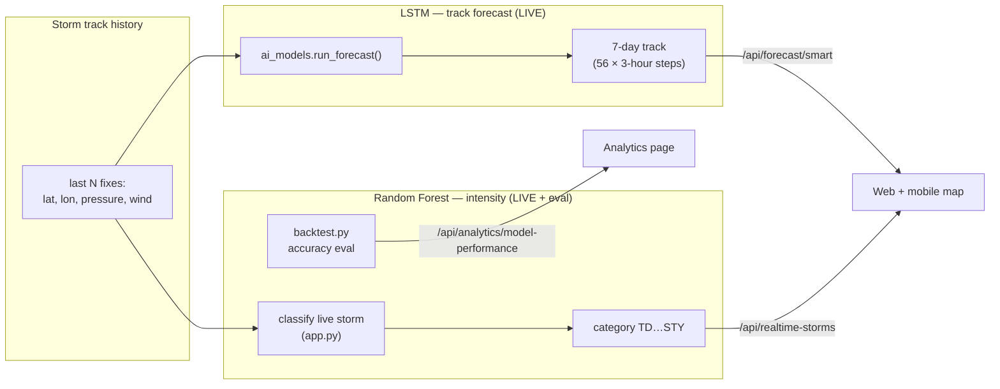

# HeadsUp — How the Machine Learning Works (LSTM + Random Forest)

This document explains, in detail, how HeadsUp uses its two machine-learning
algorithms:

1. **LSTM (Long Short-Term Memory)** — forecasts the **storm track** (where the
   typhoon will go) over the next 7 days.
2. **Random Forest** — classifies the **storm intensity category** (how strong
   the storm is: TD, TS, TY, SevTY, STY).

They answer two different questions: **LSTM = "where?"**, **Random Forest =
"how strong?"**.

- **Last updated:** 2026-08-04
- **Training data:** Western Pacific best-track records, `backend/data/wp_YYYY_data.json` (2013–2026)
- **Code:** `backend/scripts/ai_models.py` (LSTM inference), `backend/scripts/train_lstm.py` (LSTM training), `backend/scripts/backtest.py` (Random Forest training + evaluation)

---

## 1. Where each algorithm runs



**How each is used:**

- The **LSTM runs live** on every forecast request (`/api/forecast/smart` →
  `ai_models.run_forecast`). Every track you see on the map is the LSTM.
- The **Random Forest runs live too**: `app.py` loads
  `typhoon_rf_intensity_classifier.pkl` and classifies each active storm's
  category from its recent track (`_classify_intensity_rf`), tagged
  `category_source: "random_forest"`. A storm with fewer than 5 fixes (e.g. a
  just-formed one) falls back to the `_wind_to_cat` wind-speed bins
  (`category_source: "wind_threshold"`), which use the same category thresholds.
  The model's overall accuracy (≈90%) is separately reported on the **Analytics
  page** from the offline backtest.

---

## 2. The LSTM track model

### 2.1 What problem it solves

Given a storm's recent motion, predict its **next position and state** repeatedly
to build a 7-day path. Each prediction is one 3-hour step; 56 steps = 168 hours.

### 2.2 Input features

A sliding window of **T = 8** timesteps (the last 24 hours), each timestep a
4-value vector:

| Feature | Meaning |
|---------|---------|
| `lat` | latitude (°N) |
| `lon` | longitude (°E) |
| `pressure` | central pressure (hPa) |
| `wind_speed` | max sustained wind (knots) |

### 2.3 The key idea — hybrid "residual over physics"

A plain LSTM that predicts the next absolute position tends to **drift**: small
errors compound as its own predictions are fed back in, and it ended up *worse*
than a simple persistence forecast at every lead time.

HeadsUp fixes this by letting the LSTM predict only a **correction** to a physics
baseline:

```
next_state = persistence_step(window) + LSTM_correction(window)
```

- `persistence_step()` = an exponentially-weighted velocity-persistence baseline
  (the storm keeps moving the way it has been, recent motion weighted highest).
  It is **shared** between training and inference so the two are identical.
- The LSTM only learns the small residual the physics baseline gets wrong.
- Because the physics carries the trajectory, the rollout **cannot drift far
  worse than persistence** — which is exactly what went wrong before.

### 2.4 Network architecture

```
Input (8, 4)
  → LSTM(64)
  → Dropout(0.2)
  → Dense(32, ReLU)
  → Dense(4)         # normalised residual: Δlat, Δlon, Δpressure, Δwind
```

- **Input scaler:** `MinMaxScaler` (`lstm_scaler.pkl`) on the 4 input features.
- **Target scaler:** `StandardScaler` (`lstm_resid_scaler.pkl`) on the residuals.
- **Mode marker:** `lstm_meta.json` (`mode: residual_over_physics`, `T: 8`),
  which tells the inference code to use the hybrid rollout.

### 2.5 Training

`python backend/scripts/train_lstm.py`

- **Train:** WP storms 2013–2022. **Validation:** 2023–2025 (held out).
- Sliding windows of 8 steps → predict the next step's residual.
- Loss MSE, optimizer Adam, `EarlyStopping` on validation loss.
- Saves the model (`.keras` + `.h5`), both scalers, and `lstm_meta.json` into
  `backend/models/`.

### 2.6 Inference (how a live forecast is produced)

In `ai_models.py`, `run_forecast()` → `_run_ml_forecast()` → `_rollout_hybrid()`:

1. Build the physical window from the storm's track history (pad if short).
2. For each of 56 steps:
   - Compute the physics baseline `persistence_step(window)`.
   - Run the LSTM on the normalised window to get the residual correction.
   - `next = baseline + correction`, clip to sane physical ranges.
   - Append `next` to the window and repeat (autoregressive rollout).
3. Attach a wind field to each step (Rankine-vortex physics; see the system doc).

Output: `forecast_steps` (56 × {hour, lat, lon, pressure, wind_speed, u, v}) with
`method: "ml"`.

### 2.7 Measured accuracy (held-out 2023–2025, 67 storms)

Single 3-hour step: hybrid **21.97 km** MAE vs. persistence 22.24 km.

Multi-step track skill vs. the physics persistence baseline
(`Skill = 1 − RMSE_LSTM / RMSE_physics`; positive = LSTM wins):

| Lead | LSTM RMSE (km) | Physics RMSE (km) | Skill |
|-----:|---------------:|------------------:|------:|
| 6h | 47.2 | 60.2 | **+0.22** |
| 12h | 107.2 | 129.1 | **+0.17** |
| 24h | 244.0 | 268.2 | **+0.09** |
| 48h | 589.9 | 569.8 | −0.04 |
| 72h+ | — | — | physics marginally better |

**Reading:** the LSTM improves the operationally critical **0–24 h** track by
9–22% over persistence; at long range both degrade and physics is slightly
smoother. Numbers are reproducible via `backend/scripts/backtest.py`.

---

## 3. The Random Forest intensity classifier

### 3.1 What problem it solves

Given a storm's recent state, classify its **intensity category**:

| Class | Name | Meaning |
|------:|------|---------|
| 0 | TD | Tropical Depression |
| 1 | TS | Tropical Storm |
| 2 | TY | Typhoon |
| 3 | SevTY-3 | Severe Typhoon (tier 3) |
| 4 | SevTY-4 | Severe Typhoon (tier 4) |
| 5 | STY | Super Typhoon |

### 3.2 Input features (9 per sample)

Built in `backtest.py :: build_classification_dataset()` from the preceding
points of a storm's track:

| # | Feature | Meaning |
|--:|---------|---------|
| 1 | `lat` | latitude of the previous fix |
| 2 | `lon` | longitude of the previous fix |
| 3 | `wind` | previous wind speed |
| 4 | `pressure` | previous central pressure |
| 5 | `prev_class` | previous intensity class |
| 6 | `Δwind (12 h)` | wind change over the last 12 h |
| 7 | `Δpressure (12 h)` | pressure change over the last 12 h |
| 8 | `speed` | translation speed (km/h) |
| 9 | `time-of-day` | diurnal cycle term (sine) |

### 3.3 Model & training

```python
RandomForestClassifier(
    n_estimators=200,
    max_depth=20,
    class_weight="balanced",   # counter class imbalance (few STY samples)
    n_jobs=-1,
    random_state=42,
)
```

- **Train:** WP storms 2013–2022. **Test:** 2023–2026.
- Saved as `backend/models/typhoon_rf_intensity_classifier.pkl`.
- Run via `python backend/scripts/backtest.py`.

### 3.4 Measured accuracy

Overall accuracy **90.01%**, macro F1 **0.8010** (test set, 3,525 samples):

| Class | Precision | Recall | F1 | Support |
|-------|----------:|-------:|---:|--------:|
| TD | 0.93 | 0.95 | 0.94 | 671 |
| TS | 0.96 | 0.96 | 0.96 | 1802 |
| TY | 0.83 | 0.86 | 0.85 | 476 |
| SevTY-3 | 0.81 | 0.80 | 0.80 | 281 |
| SevTY-4 | 0.57 | 0.75 | 0.65 | 153 |
| STY | 0.94 | 0.45 | 0.61 | 142 |

The strongest categories (TD/TS/TY) are classified very accurately; the rarer
severe/super classes are harder (fewer training samples), which the
`class_weight="balanced"` setting partially compensates for.

### 3.5 Where it appears in the app

Two places:

1. **Live classification** — `app.py` loads the model once and calls
   `_classify_intensity_rf(path)` for every active storm during the 10-minute
   live-storm refresh. The predicted category feeds the storm badge on the web
   and mobile maps (`/api/realtime-storms`), tagged
   `category_source: "random_forest"`. Storms with fewer than 5 fixes fall back
   to the `_wind_to_cat` wind-speed bins.
2. **Accuracy report** — the offline backtest metrics (accuracy, macro F1,
   per-class scores, confusion matrix) are surfaced on the **Analytics page** via
   `/api/analytics/model-performance`.

The live feature vector is built to match the training layout exactly (§3.2);
`wind` is in knots in both the training data and the live feed, so the inputs are
consistent. Validated: replaying historical storms through the live path
reproduces the model's ~90% class agreement.

---

## 4. How the two algorithms combine

For any storm, HeadsUp answers both forecast questions:

- **LSTM** → the **7-day track** (a line of 56 future positions on the map).
- **Random Forest** → the **intensity category** the storm belongs to
  (its validated classifier, reported in Analytics), with the live map badge
  using the equivalent wind-speed bins.

Together they give: *"this storm will move here over the next 7 days
(**LSTM**), and it is / will be this strong (**Random Forest** categories)."*
The wind-field arrows on the map are a separate **Rankine-vortex physics** model,
not ML.

---

## 5. Status

- **LSTM:** fully live — drives every track forecast. ✔
- **Random Forest:** fully live — classifies every active storm's intensity from
  its recent track (`_classify_intensity_rf` in `app.py`), with a wind-speed-bin
  fallback only for storms with fewer than 5 fixes. Its ≈90% accuracy is
  reported on the Analytics page. ✔

Both algorithms are genuine end-to-end ML outputs in the running application.

---

## 6. File map

| File | Role |
|------|------|
| `backend/scripts/ai_models.py` | LSTM inference (hybrid rollout), physics fallback, wind field |
| `backend/scripts/train_lstm.py` | Trains the LSTM, saves model + scalers + meta |
| `backend/scripts/backtest.py` | Trains + evaluates the Random Forest; evaluates the LSTM vs physics |
| `backend/models/lstm_path_model.keras` | LSTM track model |
| `backend/models/lstm_scaler.pkl`, `lstm_resid_scaler.pkl`, `lstm_meta.json` | LSTM scalers + mode marker |
| `backend/models/typhoon_rf_intensity_classifier.pkl` | Random Forest intensity classifier |
| `backend/results/backtest_summary.txt` | Reproducible accuracy numbers |
