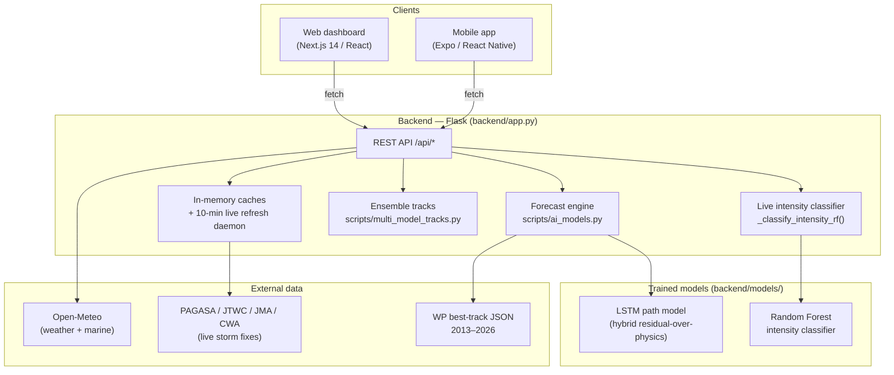

# HeadsUp — Full System Documentation

**HeadsUp** is a real-time typhoon monitoring and 7-day forecasting system for the
Philippine Area of Responsibility (PAR), with hyperlocal hazard detail for Naga
City. It combines live storm feeds, a machine-learning forecast engine
(**LSTM** for the track + **Random Forest** for intensity), a multi-agency
ensemble track plot, and weather/hazard overlays, delivered through a web
dashboard and a companion mobile app.

- **Last updated:** 2026-08-04
- **Primary region:** Western Pacific / PAR (5–25°N, 115–135°E)
- **Focus area:** Naga City, Camarines Sur
- **Two ML questions:** LSTM answers **"where will the storm go?"**; Random Forest answers **"how strong is it?"**

> A shorter, ML-only companion lives in [`ML_ALGORITHMS.md`](ML_ALGORITHMS.md).
> This document is the complete system reference.

---

## 1. High-level architecture



**One-sentence data flow:** clients call the Flask API, which serves live storm
positions (refreshed every 10 minutes), runs the **LSTM** to forecast each
storm's 7-day track, classifies each storm's intensity with the **Random
Forest**, overlays Open-Meteo weather, and computes hyperlocal hazard/impact for
the selected area.

---

## 2. Repository layout

```
HeadsUp/
├── backend/                 Flask API + ML engine + data
│   ├── app.py               REST endpoints, caches, live-storm daemon, RF classifier
│   ├── scripts/
│   │   ├── ai_models.py     Forecast engine (LSTM Mode A / physics Mode B)
│   │   ├── train_lstm.py    Trains the LSTM path model
│   │   ├── backtest.py      Trains + evaluates RF; evaluates LSTM vs physics
│   │   ├── multi_model_tracks.py   Multi-agency ensemble tracks
│   │   └── ...
│   ├── models/              Trained model artifacts (see §5.6)
│   ├── data/                wp_YYYY_data.json (2013–2026), par_archive.json
│   └── results/             backtest_summary.txt, plots, metrics JSON
├── frontend/                Next.js 14 web dashboard (App Router)
├── mobile/                  Expo / React Native app (4 tabs)
├── api/index.py             Vercel serverless entry (wraps Flask WSGI app)
├── vercel.json              Frontend + backend deployment config
└── docs/                    Specs + this document + ML_ALGORITHMS.md
```

---

## 3. Backend (Flask)

`backend/app.py` is the single Flask application. Responsibilities:

- Serve all `/api/*` REST endpoints.
- Maintain **in-memory caches** (30-minute buckets) for weather/marine/daily
  grids, plus a live-storm cache.
- Run a **background daemon thread** that refreshes live storm positions every
  **10 minutes** and classifies each storm's intensity with the Random Forest,
  so `/api/realtime-storms` answers instantly from cache.
- Fan out per-grid-point weather fetches with a `ThreadPoolExecutor`.

Run locally: `python backend/app.py` → `http://0.0.0.0:5000`. Both the web
dashboard and mobile app target port **5000**.

### 3.1 Endpoint reference

| Endpoint | Method | Purpose |
|----------|--------|---------|
| `/api/realtime-storms` | GET | Active WP storms (RF-classified category, source + freshness) |
| `/api/storm/track` | GET | Track for one storm |
| `/api/storm/year-tracks` | GET | All storm tracks for a year |
| `/api/storms/list` | GET | List available storms |
| **`/api/forecast/smart`** | POST | **Primary 7-day forecast** — LSTM (or physics fallback) |
| `/api/forecast` | POST | 7-day forecast (explicit track_history) |
| `/api/forecast/from-storm` | POST | Forecast seeded from a named storm |
| `/api/forecast/chart` | POST | Forecast rendered as a chart |
| `/api/multi-model-tracks` | POST | Multi-agency ensemble spaghetti tracks |
| `/api/weather/fullgrid` | GET | Full 7-day hourly weather grid (168 h/point) |
| `/api/weather/daily` | GET | Per-location 7-day daily summary (default Naga City) |
| `/api/weather/grid`, `/api/weather/realtime` | GET | Coarse / current weather |
| `/api/weather/marine`, `/api/weather/marine/fullgrid` | GET | Wave grids |
| `/api/climate/outlook` | GET | Seasonal climate outlook |
| `/api/analytics/model-performance` | GET | Backtest metrics (RF + LSTM) for Analytics |
| `/api/analytics/plot/<name>` | GET | Rendered analytics plot image |
| `/api/par-archive` | GET / POST | List / append the PAR storm archive |
| `/api/map`, `/api/map/simple` | GET | Base map images |

### 3.2 External data sources

- **Open-Meteo** — hourly + daily weather and wave height. No API key.
- **Live storm feeds** — PAGASA / JTWC / JMA (and optionally CWA/Taiwan with
  `CWA_API_KEY`) parsed for active Western Pacific storms.
- **Historical best-track** — `data/wp_YYYY_data.json` (2013–2026); each storm
  has a 3-hourly `path` of `lat`, `long`, `pressure`, `speed`, `class`. Used to
  train and backtest both models.

---

## 4. The forecast engine — two modes

`scripts/ai_models.py` picks a mode automatically:

- **Mode A — ML** (`_run_ml_forecast`): used whenever the LSTM model file exists.
  Returns `method: "ml"`. **This is the normal path.**
- **Mode B — Physics** (`_run_physics_forecast`): kinematic extrapolation +
  Rankine-vortex wind field. A **fallback** used only if the LSTM files are
  missing or ML inference throws. Returns `method: "physics"`.

```python
if _ml_available():
    try:
        return _run_ml_forecast(track_history, steps)   # Mode A (LSTM)
    except Exception:
        ...                                             # fall back
return _run_physics_forecast(track_history, steps)      # Mode B (physics)
```

---

## 5. How the machine learning works

HeadsUp uses **two** ML algorithms that answer different questions:

| Algorithm | Question | Output | Where it runs |
|-----------|----------|--------|---------------|
| **LSTM** | Where will it go? | 7-day track (56 × 3-hour steps) | Live, every forecast |
| **Random Forest** | How strong is it? | Intensity category (TD…STY) | Live, every storm refresh |

### 5.1 LSTM — the track model

**Problem.** Given a storm's recent motion, predict its next position and state,
repeated to build a 7-day path (each step = 3 hours; 56 steps = 168 hours).

**Input features.** A sliding window of **T = 8** timesteps (the last 24 hours),
each a 4-value vector:

| Feature | Meaning |
|---------|---------|
| `lat` | latitude (°N) |
| `lon` | longitude (°E) |
| `pressure` | central pressure (hPa) |
| `wind_speed` | max sustained wind (knots) |

**The key idea — hybrid "residual over physics."** A plain LSTM that predicts
the next *absolute* position tends to **drift**: its own small errors compound as
they are fed back in, and it ended up *worse* than a trivial persistence
forecast at every lead time. HeadsUp instead lets the LSTM predict only a
**correction** to a physics baseline:

```
next_state = persistence_step(window) + LSTM_correction(window)
```

- `persistence_step()` is an exponentially-weighted velocity-persistence baseline
  (the storm keeps moving the way it has been, recent motion weighted highest).
  It is **shared** by training and inference, so the two are identical.
- The LSTM learns only the small residual the physics gets wrong.
- Because the physics carries the trajectory, the rollout **cannot drift far
  worse than persistence** — which is exactly what fixed the earlier failure.

**Network architecture.**

```
Input (8, 4)
  → LSTM(64)
  → Dropout(0.2)
  → Dense(32, ReLU)
  → Dense(4)         # normalised residual: Δlat, Δlon, Δpressure, Δwind
```

- Input scaler: `MinMaxScaler` (`lstm_scaler.pkl`).
- Residual-target scaler: `StandardScaler` (`lstm_resid_scaler.pkl`).
- Mode marker: `lstm_meta.json` (`mode: residual_over_physics`, `T: 8`).

**Training** (`python backend/scripts/train_lstm.py`):

- Train on WP storms **2013–2022**; validate on **2023–2025** (held out).
- Sliding windows of 8 steps → predict the next step's residual.
- Loss MSE, Adam, `EarlyStopping` on validation loss.
- Saves the model (`.keras` + `.h5`), both scalers, and `lstm_meta.json`.

**Inference** (`run_forecast` → `_run_ml_forecast` → `_rollout_hybrid`):

1. Build the physical window from the storm's track history.
2. For each of 56 steps:
   - Compute the physics baseline `persistence_step(window)`.
   - Run the LSTM on the normalised window → residual correction.
   - `next = baseline + correction`, clip to sane physical ranges.
   - Append `next` to the window and repeat (autoregressive rollout).
3. Attach a wind field to each step (Rankine physics; §5.4).

**Accuracy (held-out 2023–2025, 67 storms).** Track skill vs. the physics
persistence baseline (`Skill = 1 − RMSE_LSTM / RMSE_physics`; positive = LSTM
wins):

| Lead | LSTM RMSE (km) | Physics RMSE (km) | Skill |
|-----:|---------------:|------------------:|------:|
| 6h | 47.2 | 60.2 | **+0.22** |
| 12h | 107.2 | 129.1 | **+0.17** |
| 24h | 244.0 | 268.2 | **+0.09** |
| 48h | 589.9 | 569.8 | −0.04 |
| 72h+ | — | — | physics marginally better |

The LSTM improves the operationally critical **0–24 h** track by 9–22% over
persistence; at long range both degrade.

### 5.2 Random Forest — the intensity classifier

**Problem.** Given a storm's recent state, classify its intensity category:

| Class | Name | Class | Name |
|------:|------|------:|------|
| 0 | TD (Tropical Depression) | 3 | SevTY-3 (Severe Typhoon) |
| 1 | TS (Tropical Storm) | 4 | SevTY-4 (Severe Typhoon) |
| 2 | TY (Typhoon) | 5 | STY (Super Typhoon) |

**Input features (9).** Built from the storm's recent fixes (identical in
`backtest.py :: build_classification_dataset` and the live
`app.py :: _classify_intensity_rf`):

| # | Feature | Meaning |
|--:|---------|---------|
| 1–2 | `lat`, `lon` | position of the previous fix |
| 3 | `wind` | previous wind speed (knots) |
| 4 | `pressure` | previous central pressure |
| 5 | `prev_class` | previous intensity class |
| 6 | `Δwind (12 h)` | wind change over the last 12 h |
| 7 | `Δpressure (12 h)` | pressure change over the last 12 h |
| 8 | `speed` | translation speed (km/h) |
| 9 | `time-of-day` | diurnal cycle term (sine) |

**Model & training** (`python backend/scripts/backtest.py`):

```python
RandomForestClassifier(
    n_estimators=200, max_depth=20,
    class_weight="balanced",   # counter class imbalance (few STY samples)
    n_jobs=-1, random_state=42,
)
```

Trained on 2013–2022, tested on 2023–2026, saved as
`models/typhoon_rf_intensity_classifier.pkl`.

**Live classification.** During the 10-minute live-storm refresh, `app.py` loads
the model once (thread-safe, double-checked locking) and calls
`_classify_intensity_rf(path)` for each active storm. The predicted category
feeds the storm badge on the web and mobile maps via `/api/realtime-storms`,
tagged `category_source: "random_forest"`. A storm with **fewer than 5 fixes**
(e.g. a just-formed one) falls back to the `_wind_to_cat` wind-speed bins
(`category_source: "wind_threshold"`), which use the same category thresholds.

> **Unit consistency:** the historical training `speed` and the live feed
> `wind_speed` are both in **knots** (the per-class boundaries 34/64/96/113/137
> confirm it), so the live feature vector matches the training layout. Replaying
> historical storms through the live path reproduces the model's ~90% class
> agreement.

**Accuracy.** Overall **≈90%**, macro F1 **≈0.80** (test set, ~3,500 samples):

| Class | Precision | Recall | F1 | Support |
|-------|----------:|-------:|---:|--------:|
| TD | 0.93 | 0.95 | 0.94 | 671 |
| TS | 0.96 | 0.96 | 0.96 | 1802 |
| TY | 0.83 | 0.86 | 0.85 | 476 |
| SevTY-3 | 0.81 | 0.80 | 0.80 | 281 |
| SevTY-4 | 0.57 | 0.75 | 0.65 | 153 |
| STY | 0.94 | 0.45 | 0.61 | 142 |

The common categories (TD/TS/TY) are classified very accurately; the rarer
severe/super classes are harder (fewer samples), partly offset by
`class_weight="balanced"`.

### 5.3 How the two combine

For any storm HeadsUp answers both questions at once: the **LSTM** draws the
7-day track line on the map, and the **Random Forest** labels the storm's
intensity category (the badge). Together:
*"this storm will move here over the next 7 days (**LSTM**), and it is this
strong (**Random Forest**)."*

### 5.4 Physics fallback + wind field

- **Mode B (physics)** — kinematic persistence with beta-drift/recurvature; used
  only when the LSTM is unavailable. Keeps the app working if ML fails.
- **Wind field** — the 20×20 PAR `u`/`v` arrows are a modified **Rankine-vortex
  physics** model (`_rankine_wind_field`), tagged `wind_method: "rankine"`. This
  is physics, not ML. (An optional per-grid RF wind regressor is supported but
  not trained.)

### 5.5 Single-fix storms

A just-formed storm may have only one fix (no motion history).
`/api/forecast/smart` seeds a prior point from nominal **WNW climatological
drift** so a track + grid is still produced, flagged
`assumed_initial_motion: true`.

### 5.6 Model artifacts (`backend/models/`)

| File | Purpose |
|------|---------|
| `lstm_path_model.keras` / `.h5` | LSTM track model (Keras) |
| `lstm_scaler.pkl` | MinMaxScaler for LSTM inputs |
| `lstm_resid_scaler.pkl` | StandardScaler for the residual target |
| `lstm_meta.json` | Mode + config (`residual_over_physics`, T=8) |
| `typhoon_rf_intensity_classifier.pkl` | Random Forest intensity classifier |

> All scikit-learn artifacts must be generated with the **same scikit-learn
> version** the app runs (see §9). A mismatch raises `InconsistentVersionWarning`
> and risks invalid predictions.

---

## 6. Multi-model ensemble tracks

`scripts/multi_model_tracks.py` (via `/api/multi-model-tracks`) produces a
multi-agency **spaghetti plot** — several global agency model tracks per storm —
plus consensus. If live agency data is unreachable, the frontend falls back to a
local deterministic ensemble so the UI still works offline.

---

## 7. Hazard, impact & alerts

Hyperlocal hazard modeling lives in `frontend/lib/` (mirrored in `mobile/lib/`):

- `tcws.ts` — Tropical Cyclone Wind Signal levels.
- `flood.ts`, `surge.ts` — rainfall-driven flood + storm-surge indices with
  **Naga barangay-level** susceptibility.
- `hazard.ts`, `impact.ts`, `prep.ts` — hazard scoring, impact forecast,
  preparedness guidance for a selected area.
- `par.ts`, `geo.ts` — PAR geofence + geospatial helpers.

The web **PAR broadcast engine** (`hooks/useParBroadcastEngine.ts`) issues
geofenced alerts on a 3-hour cadence, surfaced via `components/alerts/`.

---

## 8. Frontend & mobile

**Web (Next.js 14, `frontend/`).** Routes: `/` (dashboard), `/analytics`,
`/my-area`. Key components: `map/HurricaneTracker` (live storms + LSTM forecast
tracks + ensemble), `map/WeatherOverlayCanvas` / `WindParticleCanvas`,
`timeline/TimelineBar` (playback + 7-day Naga daily cards), `sidebar/`,
`alerts/`, `analytics/`, `impact/`. Data hooks: `useWeatherData`, `useTimeline`,
`useWindEngine`, `useParBroadcastEngine`, `useDashboardState`.

**Mobile (Expo / React Native, `mobile/`).** 4 tabs (Home, Map, Alerts,
Analytics) + a My-Area screen; reuses the same Flask backend and mirrors the
hazard/impact/TCWS logic. `mobile/lib/config.ts` auto-derives the backend URL
from Expo's Metro host (`http://<LAN-IP>:5000`), so it survives DHCP IP changes.

---

## 9. Deployment & environment setup

### Local development

```bash
# Backend (terminal 1) — use ONE Python environment for everything
cd backend
python -m venv .venv && .venv/Scripts/activate       # Windows
pip install -r requirements_local.txt                # Flask + tensorflow + scikit-learn + joblib + matplotlib
python app.py                                         # http://localhost:5000

# Frontend (terminal 2)
cd frontend && npm install && npm run dev             # http://localhost:3000

# Mobile (terminal 3)
cd mobile && npm install && npx expo start            # open in Expo Go
```

> **Important — one environment for train + serve.** The LSTM needs
> **TensorFlow**, and the Random Forest + LSTM scalers are scikit-learn pickles
> that must be **loaded with the same scikit-learn version they were saved with**.
> If you run the app in a virtualenv, install TensorFlow and scikit-learn there
> and (re)generate the models from that same venv:
>
> ```bash
> .venv/Scripts/python scripts/train_lstm.py   # regenerates LSTM + scalers
> .venv/Scripts/python scripts/backtest.py     # regenerates the RF classifier
> ```
>
> Otherwise you may see `InconsistentVersionWarning`, or the LSTM silently
> falling back to physics because TensorFlow is missing.

### Vercel

`vercel.json` declares two services: the **frontend** (Next.js at `/`) and the
**backend** (Flask at `/_/backend`, entry `app.py`). `api/index.py` wraps the
Flask WSGI `app` object as the serverless handler.

### Environment variables

| Variable | Where | Purpose |
|----------|-------|---------|
| `NEXT_PUBLIC_API_URL` | frontend | Backend base URL (empty = same origin) |
| `EXPO_PUBLIC_API_URL` | mobile | Backend base URL override |
| `CWA_API_KEY` | backend | Optional — unlocks the Taiwan (CWA) live storm feed |

---

## 10. Accuracy & honesty notes

What is ML vs. physics vs. assumption:

- **Track forecast → LSTM** (hybrid residual-over-physics). Live; beats
  persistence at 6–24 h.
- **Intensity category → Random Forest.** Live (`_classify_intensity_rf`), ≈90%
  accuracy; wind-speed-bin fallback only for storms with < 5 fixes.
- **Wind-field arrows → Rankine-vortex physics**, not ML.
- **Single-fix new storms →** initial heading is a **climatological assumption**
  (`assumed_initial_motion: true`), replaced by real motion once a second fix
  arrives.
- **Mode B (physics) →** dormant fallback for robustness, not the primary path.
- **Weather/wave data →** live from Open-Meteo; the 7-day daily cards summarize
  Naga City specifically, not a basin-wide average.

**In short:** HeadsUp runs on **LSTM (track) + Random Forest (intensity)**, both
live end-to-end, with a physics engine as a failover and a physics-based wind
field — an honest, defensible architecture.
