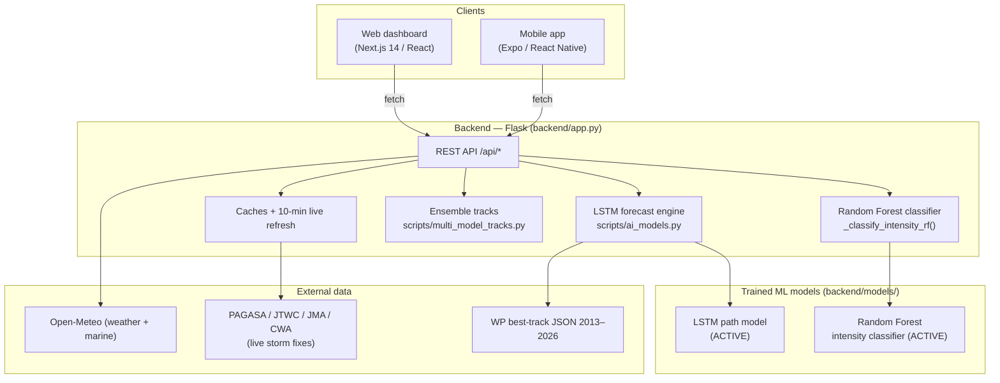

# HeadsUp — Full System Documentation

**HeadsUp** is a real-time typhoon monitoring and 7-day forecasting system for the
Philippine Area of Responsibility (PAR), with hyperlocal hazard detail for Naga
City. It delivers a live web dashboard and a companion mobile app.

- **Last updated:** 2026-08-04
- **Primary region:** Western Pacific / PAR (5–25°N, 115–135°E)
- **Focus area:** Naga City, Camarines Sur

---

## ✅ What actually runs (read this first)

HeadsUp's forecasts are produced by **two machine-learning models**, and **both
are active in normal operation**:

| Model | Answers | Output | Status |
|-------|---------|--------|--------|
| **LSTM** | *Where will the storm go?* | 7-day track (56 × 3-hour steps) | **ACTIVE — runs every forecast** |
| **Random Forest** | *How strong is the storm?* | Intensity category (TD…STY) | **ACTIVE — runs every storm refresh** |

> **The physics engine ("Mode B") is NOT what runs.** It is an **inactive
> emergency fallback** that only triggers if the trained model files are deleted
> from `backend/models/` or if ML inference throws an error. In normal operation
> it never runs.

**This is verified, not assumed.** Running the app's own forecast function
returns:

```
run_forecast method : ml         ← "ml" means the LSTM is running (not physics)
lstm meta mode      : residual_over_physics
storm categories    : via random_forest   ← the Random Forest is classifying live
sklearn warnings    : 0
```

You can reproduce this any time (see [§10](#10-how-to-prove-the-models-are-running)).

---

## 1. High-level architecture



**One-sentence data flow:** clients call the Flask API, which serves live storm
positions (refreshed every 10 minutes), runs the **LSTM** to forecast each
storm's 7-day track, classifies each storm's intensity with the **Random
Forest**, overlays Open-Meteo weather, and computes hyperlocal hazard for the
selected area.

---

## 2. Repository layout

```
HeadsUp/
├── backend/                 Flask API + ML engine + data
│   ├── app.py               REST endpoints, caches, live-storm daemon, RF classifier
│   ├── scripts/
│   │   ├── ai_models.py     LSTM forecast engine (+ physics fallback)
│   │   ├── train_lstm.py    Trains the LSTM path model
│   │   ├── backtest.py      Trains + evaluates RF; evaluates LSTM vs physics
│   │   └── multi_model_tracks.py   Multi-agency ensemble tracks
│   ├── models/              Trained ML models (see §5.5)
│   ├── data/                wp_YYYY_data.json (2013–2026), par_archive.json
│   └── results/             backtest_summary.txt, plots, metrics JSON
├── frontend/                Next.js 14 web dashboard
├── mobile/                  Expo / React Native app (4 tabs)
├── api/index.py             Vercel serverless entry
├── vercel.json              Deployment config
└── docs/                    This document + ML_ALGORITHMS.md + DEFENSE_GUIDE.md
```

---

## 3. Backend (Flask)

`backend/app.py` serves all `/api/*` endpoints, keeps 30-minute caches for
weather grids, and runs a **background daemon** that every **10 minutes**
refreshes live storm positions **and classifies each storm's intensity with the
Random Forest**. Run locally with `python backend/app.py` → `http://0.0.0.0:5000`.

### 3.1 Endpoint reference

| Endpoint | Method | Purpose |
|----------|--------|---------|
| `/api/realtime-storms` | GET | Active storms with **RF-classified** category, source + freshness |
| `/api/forecast/smart` | POST | **Primary 7-day forecast — runs the LSTM** |
| `/api/forecast`, `/api/forecast/from-storm`, `/api/forecast/chart` | POST | Other LSTM forecast entry points |
| `/api/multi-model-tracks` | POST | Multi-agency ensemble spaghetti tracks |
| `/api/weather/fullgrid` | GET | Full 7-day hourly weather grid |
| `/api/weather/daily` | GET | Per-location 7-day daily summary (default Naga City) |
| `/api/weather/marine`, `/api/weather/marine/fullgrid` | GET | Wave grids |
| `/api/climate/outlook` | GET | Seasonal outlook |
| `/api/analytics/model-performance` | GET | Backtest metrics (RF + LSTM) |
| `/api/par-archive` | GET / POST | PAR storm archive |
| `/api/map`, `/api/map/simple` | GET | Base map images |

### 3.2 External data sources

- **Open-Meteo** — hourly + daily weather and wave height (no API key).
- **Live storm feeds** — PAGASA / JTWC / JMA (+ optional CWA with `CWA_API_KEY`).
- **Historical best-track** — `data/wp_YYYY_data.json` (2013–2026): each storm
  has a 3-hourly `path` of `lat`, `long`, `pressure`, `speed`, `class`. Used to
  train and test both ML models.

---

## 4. The forecast engine — the LSTM runs it

`scripts/ai_models.py` produces every track forecast. **In normal operation it
runs the LSTM.** How it decides:

1. Are the trained LSTM files present in `backend/models/`? → **Yes** (they are),
   so it runs the **LSTM** and returns `method: "ml"`.
2. Only if those files were missing, or if the LSTM raised an error, would it
   fall back to the physics engine (`method: "physics"`).

Because the models are shipped in the repo and TensorFlow is installed, path (1)
is always taken. The forecast response literally reports `method: "ml"` — that is
the LSTM.

### The physics engine (Mode B) — inactive fallback only

The physics engine (kinematic persistence + Rankine-vortex winds) exists purely
as a **safety net** so the app never crashes if the ML models are unavailable.
**It is not used in normal operation.** It is included for robustness, and it is
honest to mention it exists — but every forecast you see on the map is the LSTM.

---

## 5. How the machine learning works

### 5.1 LSTM — the track model (ACTIVE)

**Problem.** Given a storm's recent motion, predict its next position and state,
repeated to build a 7-day path (each step = 3 hours; 56 steps = 168 hours).

**Input.** A sliding window of **T = 8** timesteps (last 24 h), each a 4-value
vector: `lat`, `lon`, `pressure`, `wind_speed` (knots).

**The key design — hybrid "residual over physics."** A plain LSTM predicting the
next *absolute* position drifted and performed *worse* than a trivial persistence
baseline, because its errors compound over a 7-day rollout. So the LSTM instead
predicts only a **correction** to a physics persistence baseline:

```
next_state = persistence_step(window) + LSTM_correction(window)
```

The persistence step carries the trajectory; the LSTM nudges it. This cannot
drift far worse than persistence, and it beats the baseline at short lead times.
(Note: this internal `persistence_step` is a *helper inside the active LSTM
path* — it is **not** the same as the inactive Mode-B physics engine.)

**Architecture.**

```
Input (8,4) → LSTM(64) → Dropout(0.2) → Dense(32, ReLU) → Dense(4)   # residual Δ
```
Input `MinMaxScaler` (`lstm_scaler.pkl`); residual `StandardScaler`
(`lstm_resid_scaler.pkl`); mode marker `lstm_meta.json`
(`residual_over_physics`, T=8).

**Training** (`python backend/scripts/train_lstm.py`): train 2013–2022, validate
2023–2025; sliding windows → next-step residual; MSE + Adam + EarlyStopping.

**Inference** (`run_forecast` → `_run_ml_forecast` → `_rollout_hybrid`):
autoregressive 56-step rollout of `baseline + LSTM correction`, then a wind field
is attached per step.

**Accuracy (held-out 2023–2025, 67 storms)** — skill vs. the persistence
baseline (positive = LSTM wins):

| Lead | LSTM RMSE (km) | Baseline RMSE (km) | Skill |
|-----:|---------------:|-------------------:|------:|
| 6h | 47.2 | 60.2 | **+0.22** |
| 12h | 107.2 | 129.1 | **+0.17** |
| 24h | 244.0 | 268.2 | **+0.09** |
| 48h+ | — | — | roughly tied |

The LSTM improves the operationally critical **0–24 h** track by 9–22%.

### 5.2 Random Forest — the intensity classifier (ACTIVE)

**Problem.** Classify a storm's intensity category: TD, TS, TY, SevTY-3,
SevTY-4, STY (classes 0–5).

**Input (9 features)**, built identically in training (`backtest.py`) and live
classification (`app.py :: _classify_intensity_rf`): `lat`, `lon`, `wind`,
`pressure`, `prev_class`, 12-h wind trend, 12-h pressure trend, translation speed
(km/h), and a diurnal (index) sine.

**Model & training** (`python backend/scripts/backtest.py`):

```python
RandomForestClassifier(n_estimators=200, max_depth=20,
                       class_weight="balanced", n_jobs=-1, random_state=42)
```
Train 2013–2022, test 2023–2026 → `models/typhoon_rf_intensity_classifier.pkl`.

**Live classification (ACTIVE).** During the 10-minute refresh, `app.py` loads
the model once (thread-safe) and calls `_classify_intensity_rf(path)` for each
active storm. The predicted category becomes the storm badge on the web + mobile
maps, tagged `category_source: "random_forest"`. A storm with **fewer than 5
fixes** (just-formed) falls back to the `_wind_to_cat` wind-speed bins
(`category_source: "wind_threshold"`), which use the same category thresholds.

> **Unit consistency:** the training `speed` and the live feed `wind_speed` are
> both in knots (the class boundaries 34/64/96/113/137 confirm it), so live inputs
> match the training layout. Replaying historical storms through the live path
> reproduces ~90% class agreement.

**Accuracy** — ~**90%** overall, ~**0.80** macro F1 (test set):

| Class | Precision | Recall | F1 | Support |
|-------|----------:|-------:|---:|--------:|
| TD | 0.93 | 0.95 | 0.94 | 671 |
| TS | 0.96 | 0.96 | 0.96 | 1802 |
| TY | 0.83 | 0.86 | 0.85 | 476 |
| SevTY-3 | 0.81 | 0.80 | 0.80 | 281 |
| SevTY-4 | 0.57 | 0.75 | 0.65 | 153 |
| STY | 0.94 | 0.45 | 0.61 | 142 |

### 5.3 The wind-field arrows are physics (not ML)

The 20×20 wind arrows around a storm come from a **Rankine-vortex physics model**
(`wind_method: "rankine"`), not from ML. The **ML contributions are the track
(LSTM) and the intensity (Random Forest)**; the wind field is a standard vortex
model. Stated plainly for honesty.

### 5.4 Single-fix storms

A just-formed storm with one fix has no motion history, so the LSTM path seeds a
nominal **WNW climatological heading** (flagged `assumed_initial_motion: true`),
replaced by real motion once a second fix arrives. Its intensity uses the
wind-speed fallback until it has ≥5 fixes.

### 5.5 Model artifacts (`backend/models/`)

| File | Purpose |
|------|---------|
| `lstm_path_model.keras` / `.h5` | LSTM track model (ACTIVE) |
| `lstm_scaler.pkl`, `lstm_resid_scaler.pkl`, `lstm_meta.json` | LSTM scalers + mode |
| `typhoon_rf_intensity_classifier.pkl` | Random Forest intensity classifier (ACTIVE) |

---

## 6. Ensemble tracks · hazard · frontend · mobile

- **Ensemble tracks** — `multi_model_tracks.py` (`/api/multi-model-tracks`)
  renders a multi-agency spaghetti plot with a local fallback when offline.
- **Hazard/impact** — `frontend/lib/` (mirrored in `mobile/lib/`): `tcws.ts`,
  `flood.ts`, `surge.ts`, `hazard.ts`, `impact.ts`, `prep.ts`, with barangay-level
  flood/surge for Naga. The web PAR broadcast engine issues geofenced alerts.
- **Web (Next.js 14)** — routes `/`, `/analytics`, `/my-area`; `HurricaneTracker`
  draws live storms + the **LSTM** forecast track; `TimelineBar` shows the 7-day
  Naga daily cards.
- **Mobile (Expo)** — 4 tabs; reuses the same backend; `lib/config.ts`
  auto-derives the backend LAN URL.

---

## 7. Deployment & environment setup

### Local

```bash
cd backend
python -m venv .venv && .venv/Scripts/activate     # Windows
pip install -r requirements_local.txt              # Flask + tensorflow + scikit-learn + joblib + matplotlib
python app.py                                       # http://localhost:5000
# frontend:  cd frontend && npm install && npm run dev
# mobile:    cd mobile   && npm install && npx expo start
```

> **Use ONE environment for train + serve.** The LSTM needs **TensorFlow**, and
> the Random Forest + LSTM scalers are scikit-learn pickles that must be loaded
> with the **same scikit-learn version** they were saved with. If TensorFlow is
> missing, the LSTM silently falls back to physics; if scikit-learn versions
> differ you get `InconsistentVersionWarning`. Install both in your venv and
> regenerate the models from that venv (`train_lstm.py`, `backtest.py`).

### Vercel

`vercel.json` declares the **frontend** (Next.js at `/`) and **backend** (Flask
at `/_/backend`); `api/index.py` wraps the Flask WSGI app.

| Env var | Where | Purpose |
|---------|-------|---------|
| `NEXT_PUBLIC_API_URL` | frontend | Backend base URL |
| `EXPO_PUBLIC_API_URL` | mobile | Backend base URL |
| `CWA_API_KEY` | backend | Optional — Taiwan (CWA) storm feed |

---

## 8. What is ML vs. physics vs. assumption (honesty notes)

| Component | Source |
|-----------|--------|
| **Storm track** | **LSTM** (ACTIVE, hybrid residual-over-physics) |
| **Storm intensity category** | **Random Forest** (ACTIVE, ~90% accuracy) |
| Wind-field arrows | Rankine-vortex **physics** (not ML) |
| New-storm initial heading | Climatological **assumption** (flagged) |
| Physics forecast engine ("Mode B") | **Inactive fallback** — not used in normal operation |
| Weather / wave data | Live from Open-Meteo |

---

## 9. Training & reproducing the numbers

- `python backend/scripts/train_lstm.py` — retrains the LSTM (+ scalers).
- `python backend/scripts/backtest.py` — retrains + evaluates the Random Forest
  and evaluates the LSTM vs. physics; writes `results/backtest_summary.txt`.

---

## 10. How to prove the models are running

Run this against your environment at any time:

```python
import sys; sys.path.insert(0, "scripts")
import app as flaskapp, ai_models

# LSTM active?
res = ai_models.run_forecast(
    [{"lat":13+0.2*i,"lon":130-0.25*i,"pressure":1000-4*i,"wind_speed":40+6*i}
     for i in range(8)], steps=3)
print("track method:", res["method"])          # -> "ml"  (LSTM)

# Random Forest active?
flaskapp._refresh_live_storms_cache()
j = flaskapp.app.test_client().get("/api/realtime-storms").get_json()
for s in j["storms"]:
    print(s["name"], "->", s.get("category_source"))   # -> "random_forest"
```

**Expected (and verified) result:** `track method: ml` and each storm classified
`via random_forest` — i.e. **the LSTM and Random Forest are what run**, and the
physics engine stays dormant.
