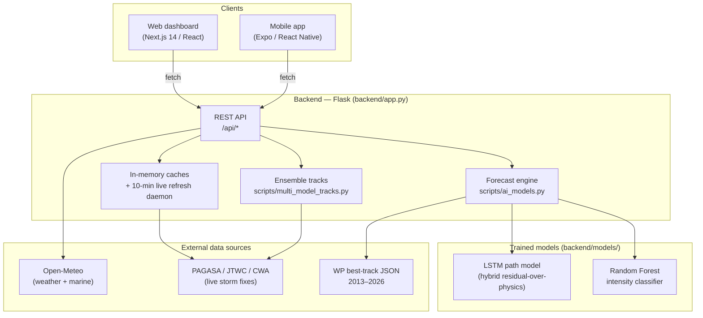

# HeadsUp — System Documentation

**HeadsUp** is a real-time typhoon monitoring and 7-day forecasting system for the
Philippine Area of Responsibility (PAR), with hyperlocal hazard detail for Naga
City. It combines live storm feeds, a machine-learning forecast engine
(LSTM track + Random Forest intensity), a multi-agency ensemble track plot, and
weather/hazard overlays, delivered through a web dashboard and a companion
mobile app.

- **Last updated:** 2026-08-04
- **Primary region:** Western Pacific / PAR (5–25°N, 115–135°E)
- **Focus area:** Naga City, Camarines Sur

---

## 1. High-level architecture



**Data flow in one sentence:** clients call the Flask API, which serves live
storm positions (refreshed from external feeds every 10 minutes), runs the ML
forecast engine on a storm's track history, overlays Open-Meteo weather, and
computes hyperlocal hazard/impact for the selected area.

---

## 2. Repository layout

```
HeadsUp/
├── backend/                 Flask API + ML engine + data
│   ├── app.py               All REST endpoints, caches, live-storm daemon
│   ├── scripts/
│   │   ├── ai_models.py     Forecast engine (Mode A ML / Mode B physics)
│   │   ├── train_lstm.py    Trains the LSTM path model
│   │   ├── backtest.py      Evaluates track (LSTM vs physics) + intensity (RF)
│   │   ├── multi_model_tracks.py   Multi-agency ensemble spaghetti tracks
│   │   ├── stormforecasting.py, typhoon_scraper.py, map_maker.py, ...
│   ├── models/              Trained model artifacts (see §5.4)
│   ├── data/                wp_YYYY_data.json (2013–2026), par_archive.json
│   └── results/             backtest_summary.txt, plots, metrics JSON
├── frontend/                Next.js 14 web dashboard (App Router)
│   ├── app/                 Routes: /, /analytics, /my-area
│   ├── components/          Map, timeline, sidebar, alerts, analytics, impact
│   ├── hooks/               Data fetching + timeline + wind engine
│   └── lib/                 Hazard/impact/geo/TCWS models + constants
├── mobile/                  Expo / React Native app (4 tabs)
├── api/index.py             Vercel serverless entry (wraps Flask WSGI app)
├── vercel.json              Frontend + backend deployment config
└── docs/                    Specs + this document
```

---

## 3. Backend (Flask)

`backend/app.py` is the single Flask application. Responsibilities:

- Serve all `/api/*` REST endpoints.
- Maintain **in-memory caches** to keep responses fast and reduce external calls:
  `weather_grid_cache`, `full_grid_cache`, `marine_full_grid_cache`,
  `daily_forecast_cache` (all 30-minute buckets), and `live_storms_cache`.
- Run a **background daemon thread** that refreshes live storm positions every
  **10 minutes**, so `/api/realtime-storms` answers instantly from cache.
- Fan out per-grid-point weather fetches with a `ThreadPoolExecutor`.

Run locally: `python backend/app.py` → serves on `http://0.0.0.0:5000`
(`debug=True`). The mobile app and web dashboard both target port **5000**.

### 3.1 Endpoint reference

| Endpoint | Method | Purpose |
|----------|--------|---------|
| `/api/realtime-storms` | GET | Active WP storms from the cached live feed (source + freshness) |
| `/api/storm/track` | GET | Track for a single storm |
| `/api/storm/year-tracks` | GET | All storm tracks for a given year |
| `/api/storms/list` | GET | List available storms |
| `/api/typhoons` | POST | Legacy typhoon query |
| `/api/typhoons/status` | GET | Loading/status flags |
| **`/api/forecast/smart`** | POST | **Primary 7-day forecast** — auto source, LSTM+RF or physics fallback |
| `/api/forecast` | POST | 7-day forecast (explicit track_history) |
| `/api/forecast/from-storm` | POST | Forecast seeded from a named storm |
| `/api/forecast/chart` | POST | Forecast rendered as a chart |
| `/api/multi-model-tracks` | POST | Multi-agency ensemble spaghetti tracks |
| `/api/weather/grid` | GET | Coarse weather grid (single hour) |
| `/api/weather/fullgrid` | GET | Full 7-day hourly weather grid (168 h/point) |
| `/api/weather/daily` | GET | **Per-location 7-day daily summary (default Naga City)** |
| `/api/weather/realtime` | GET | Current weather + short hourly forecast |
| `/api/weather/marine` | GET | Marine (wave) grid |
| `/api/weather/marine/fullgrid` | GET | Full 7-day hourly wave grid |
| `/api/climate/outlook` | GET | Seasonal climate outlook |
| `/api/analytics/model-performance` | GET | Backtest metrics for the analytics page |
| `/api/analytics/plot/<name>` | GET | Rendered analytics plot image |
| `/api/par-archive` | GET / POST | List / append the PAR storm archive |
| `/api/map`, `/api/map/simple` | GET | Base map images |

### 3.2 External data sources

- **Open-Meteo** (`api.open-meteo.com`, `marine-api.open-meteo.com`) — hourly and
  daily weather (temperature, precipitation, wind, cloud, apparent temperature)
  and wave height. No API key required.
- **Live storm feeds** — PAGASA / JTWC (and optionally CWA/Taiwan when
  `CWA_API_KEY` is set) parsed for active Western Pacific storms.
- **Historical best-track** — `data/wp_YYYY_data.json` for 2013–2026, each a list
  of storms with a 3-hourly `path` of `lat`, `long`, `pressure`, `speed`,
  `class`. Used to train and backtest the models.

---

## 4. Forecast engine — `scripts/ai_models.py`

The forecast engine has two modes and picks automatically:

- **Mode A — ML** (`_run_ml_forecast`): used whenever the LSTM model file exists
  (`_ml_available()` → `_lstm_available()`). Returns `method: "ml"`.
- **Mode B — Physics** (`_run_physics_forecast`): kinematic extrapolation +
  Rankine-vortex wind field. Used only as a **fallback** when the LSTM files are
  missing, or if ML inference raises an exception. Returns `method: "physics"`.

```python
if _ml_available():
    try:
        return _run_ml_forecast(track_history, steps)   # Mode A (LSTM)
    except Exception:
        ...                                             # fall through
return _run_physics_forecast(track_history, steps)      # Mode B (physics)
```

> **Current state:** the trained LSTM exists, so the app runs **Mode A (ML)**.
> Mode B is a dormant safety net for robustness.

### 4.1 Track model — hybrid LSTM (residual-over-physics)

The LSTM predicts the **track** (lat, lon, pressure, wind), rolled out
autoregressively in 3-hour steps for 7 days (56 steps). It uses a
**residual-over-physics** design:

```
next_state = persistence_step(window) + LSTM_correction(window)
```

- `persistence_step()` is an exponentially-weighted persistence baseline shared
  by both training and inference (imported by `train_lstm.py`), so the two are
  identical.
- The LSTM only learns the **correction** to persistence, which prevents the
  autoregressive rollout from drifting far worse than physics.
- Dispatch is driven by `models/lstm_meta.json` (`mode: residual_over_physics`).
  A legacy "absolute" mode is still supported for older model files.

### 4.2 Intensity model — Random Forest

`typhoon_rf_intensity_classifier.pkl` classifies a storm's intensity category
(TD, TS, TY, SevTY-3, SevTY-4, STY) from track features. Trained/evaluated in
`backtest.py` (scikit-learn `RandomForestClassifier`, 200 trees).

### 4.3 Wind field

The 20×20 PAR wind field (`u`/`v` arrows) is produced by a **modified
Rankine-vortex physics model** (`_rankine_wind_field`), tagged
`wind_method: "rankine"`. A per-grid RF wind-field regressor
(`rf_wind_model.pkl`) is optional and **not currently trained**, so the wind
field is physics-based even in Mode A.

### 4.4 Single-fix storms

A just-formed storm may have only one position fix (no motion history). In that
case `/api/forecast/smart` seeds a prior point from nominal **WNW climatological
drift** so a track + grid is still produced, flagged
`assumed_initial_motion: true` in the response.

### 4.5 Model artifacts (`backend/models/`)

| File | Purpose |
|------|---------|
| `lstm_path_model.keras` / `.h5` | LSTM track model (Keras) |
| `lstm_scaler.pkl` | MinMaxScaler for LSTM inputs |
| `lstm_resid_scaler.pkl` | StandardScaler for the residual target |
| `lstm_meta.json` | Model mode + config (`residual_over_physics`, T=8) |
| `typhoon_rf_intensity_classifier.pkl` | Random Forest intensity classifier |

---

## 5. Training & evaluation

- **Train the LSTM:** `python backend/scripts/train_lstm.py`
  Trains on WP tracks 2013–2022, validates on 2023–2025, writes the model +
  scalers + meta into `models/`.
- **Backtest:** `python backend/scripts/backtest.py`
  Evaluates the LSTM **through the same `ai_models.run_forecast` the app uses**
  (apples-to-apples with the deployed system), compares it against the physics
  persistence baseline, trains/evaluates the RF intensity classifier, and writes
  `results/backtest_summary.txt` + `results/backtest_metrics.json` + plots.

**Held-out track skill (2023–2025, 67 storms)** — LSTM beats persistence at the
operationally critical short leads:

| Lead | LSTM RMSE (km) | Physics RMSE (km) | Skill |
|-----:|---------------:|------------------:|------:|
| 6h | 47.2 | 60.2 | +0.22 |
| 12h | 107.2 | 129.1 | +0.17 |
| 24h | 244.0 | 268.2 | +0.09 |
| 48h+ | — | — | physics marginally better |

**Intensity classification (RF):** ~90% overall accuracy, 0.80 macro F1.

Design details: `docs/superpowers/specs/2026-08-03-lstm-track-trainer-design.md`.

---

## 6. Multi-model ensemble tracks

`scripts/multi_model_tracks.py` (via `/api/multi-model-tracks`) produces a
multi-agency **spaghetti plot** — several global agency model tracks per storm —
plus consensus. The frontend renders these as colored tracks with a model
legend. If the live agency data is unreachable, the frontend falls back to a
local deterministic ensemble generator so the UI still works offline.

---

## 7. Hazard, impact & alerts

Hyperlocal hazard modeling lives in `frontend/lib/` (mirrored in `mobile/lib/`):

- `tcws.ts` — Tropical Cyclone Wind Signal (TCWS) levels.
- `flood.ts`, `surge.ts` — rainfall-driven flood and storm-surge indices with
  **Naga barangay-level** susceptibility detail.
- `hazard.ts`, `impact.ts`, `prep.ts` — combined hazard scoring, impact forecast,
  and preparedness guidance for a selected area.
- `par.ts`, `geo.ts` — PAR geofence + geospatial helpers.

The web dashboard's **PAR broadcast engine** (`hooks/useParBroadcastEngine.ts`)
issues geofenced alerts (e.g., "storm entered PAR", TCWS warranted) on a 3-hour
broadcast cadence, surfaced via `components/alerts/`.

---

## 8. Frontend (Next.js 14 web dashboard)

**Routes (`app/`):** `/` (main dashboard), `/analytics` (model performance &
backtest charts), `/my-area` (localized impact forecast).

**Key components:**

- `components/map/` — Leaflet map: `HurricaneTracker` (live storms + forecast
  tracks + ensemble), `WeatherOverlayCanvas` / `WindParticleCanvas` (weather
  layers), `CityLabels`, `ModelLegend`, `ScatterSymbols`.
- `components/timeline/TimelineBar.tsx` — playback timeline + **7-day daily
  cards** (from `/api/weather/daily`, Naga City).
- `components/sidebar/` — layer controls, left/right panels.
- `components/alerts/` — PAR alerts + notification center.
- `components/analytics/`, `components/impact/` — analytics and impact reports.

**Hooks:** `useWeatherData` (fetches full weather + marine grids once, slices by
hour client-side), `useTimeline`, `useWindEngine`/`useOverlayCanvas` (wind
particle animation), `useParBroadcastEngine`, `useDashboardState` (global state).

**Config:** `lib/constants.ts` — `API_BASE` from `NEXT_PUBLIC_API_URL`
(empty = same origin), PAR bounds, weather layer definitions.

---

## 9. Mobile app (Expo / React Native)

`mobile/` is an Expo app run via **Expo Go**, with **4 tabs**
(`app/(tabs)/`): Home (`index`), Map, Alerts, Analytics, plus a My-Area screen.
It reuses the same Flask backend and mirrors the hazard/impact/TCWS logic in
`mobile/lib/`.

**Backend URL resolution** (`mobile/lib/config.ts`): `EXPO_PUBLIC_API_URL` env →
auto-derived LAN IP from Expo's Metro host (`http://<LAN-IP>:5000`) →
`app.json` `extra.apiBaseUrl` → `localhost`. The LAN auto-detection means the
API keeps working when the dev machine's DHCP IP changes.

---

## 10. Deployment & local development

### Local

```bash
# Backend (terminal 1)
pip install -r requirements.txt        # or backend/requirements_local.txt for ML
python backend/app.py                  # http://localhost:5000

# Frontend (terminal 2)
cd frontend && npm install && npm run dev   # http://localhost:3000

# Mobile (terminal 3)
cd mobile && npm install && npx expo start   # open in Expo Go
```

### Vercel

`vercel.json` declares two services: the **frontend** (Next.js, served at `/`)
and the **backend** (Flask at `/_/backend`, entry `app.py`). `api/index.py`
wraps the Flask WSGI `app` object as the serverless handler.

### Environment variables

| Variable | Where | Purpose |
|----------|-------|---------|
| `NEXT_PUBLIC_API_URL` | frontend | Backend base URL (empty = same origin) |
| `EXPO_PUBLIC_API_URL` | mobile | Backend base URL override |
| `CWA_API_KEY` | backend | Optional — unlocks the Taiwan (CWA) live storm feed |

---

## 11. Accuracy & honesty notes

For an accurate account of what is ML vs. physics vs. assumption:

- **Track forecast → LSTM** (hybrid residual-over-physics). Real, trained, beats
  persistence at 6–24h.
- **Intensity category → Random Forest.** Real, trained, ~90% accuracy.
- **Wind-field arrows → Rankine-vortex physics**, not ML. (No RF wind-field
  model is trained.)
- **Single-fix new storms →** initial heading is a **climatological assumption**
  (`assumed_initial_motion: true`), replaced by real motion once a second fix
  arrives.
- **Mode B (physics) →** dormant fallback for robustness; not the primary path.
- **Weather/wave data →** live from Open-Meteo; the 7-day daily cards summarize a
  single representative location (Naga City), not a basin-wide average.

The system therefore runs on **LSTM + Random Forest**, with a physics engine as
a failover and a physics-based wind field — an honest, defensible architecture.
